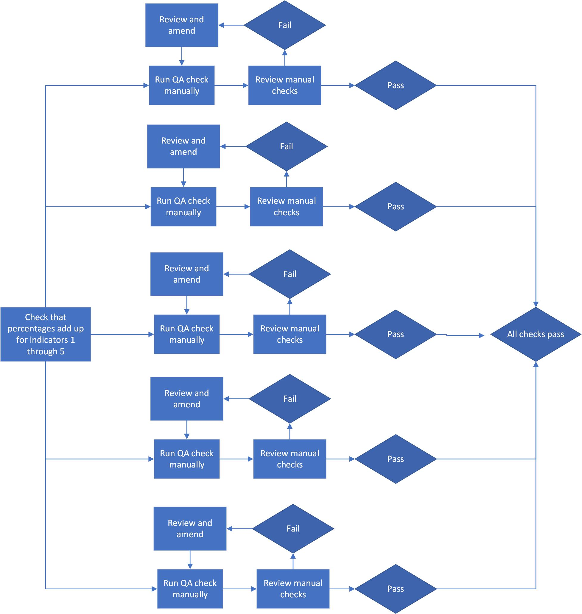
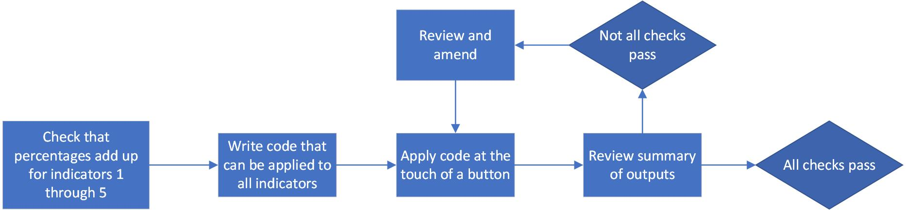

```{r xaringan-themer, include=FALSE}
library(xaringanthemer)
style_duo(
 primary_color = "#0f3b2f",
 secondary_color = "#fcb3df",
 header_font_google = google_font("Yeseva One", "400"), #Manjari
 text_font_google   = google_font("Poppins", "250", "250i"),
 code_font_google   = google_font("IBM Plex Mono")
 )
```

```{r setup, include=FALSE}
library(knitr)
library(showtext)
library(xaringan)
library(rmarkdown)
knitr::opts_chunk$set(echo = FALSE)
knitr::opts_chunk$set(error = FALSE)


```

# What we'll cover

???

Remember to record it!!

Introduce self

Implementing RAP is a key aim for our division over the next year

--

- Why we should do automated QA

--

- Examples from teams in DISD

--

- How to get started

--

- Examples of applying template code

--

- Time for questions

???

No bad time for questions, and no stupid questions

Treat RAP in the same way as the data standards and feel free to approach me with any questions or challenges you have whenever they come up

---
layout: true

# Introduction

---

--

- Quality assurance is an essential part of stats production

--

- Manual steps in production and quality assurance can introduce human errors – everybody makes mistakes

--

- Automating these steps greatly reduces the risk of human error during production cycles

--

- The OSR have stated that they **“want to see RAP become the default approach to producing official statistics”**

--

- Automating the QA step of your production cycle is a great step to using RAP in your release and is not as daunting as it may initially sound!

--

---
layout: true

# Why automate your QA?

---

### Benefits for your team

--

- Saves your team time with manual checking and tracking

--

- Helps you spot data errors early, giving you time to correct them before publication

--

- Gives a feel for interesting stories 

???

Helps you with writing the release. Where you might not have had time to sense-check every characteristic breakdown, automated reports can visualise that for you

--

- If your release is on EES, your data will already be in tidy format, making automation so much quicker and easy to apply across a range of files

--

---
layout: true

# Why automate your QA?

---

### Out with the old...


.pull-left[

- How do you answer the question **“am I happy that all my checks pass?”**


- If your QA is **not** automated, this will involve running a check, reviewing the result and amending if needed


]

.pull-right[





]


---
layout: true

# Why automate your QA?

---

### In with the new!

.center[]


--

- How do you answer the question **“am I happy that all my checks pass?”** once you've automated QA?

--

- With automated QA, you can write generalisable code and functions, allowing you to check multiple things at once and review the outcomes of checks in one go

???
You can quickly see if any checks fail, make the relevant amendments and run again.

--

- Much more efficient way to QA 

???
putting the resource into doing it right first will pay off in years to come


---
layout: true

# Examples in DISD

---


## SEN 2

- Automating QA as a part of a larger piece of work to automate the end-to-end pipeline for their release

--

- Quality assurance checks at multiple steps of the pipeline: data entry, calculation of indicators, csv outputs

--

- First team to reach “best practice” in RAP so far

--

- Updates to the “variable_change” file have made it easy to transition across for this year

--

###[Demo of SEN2 QA report](examples/QA_2020_output.html)


---
layout: true

# Examples in DISD

---


## KS4


- Previous QA involved separate checklists for every file produced

???
time consuming and resource intensive, particularly for LA files

--

- Team were brand new users to R

--

- Working with team members to learn R and Rmarkdown with a relevant example, automating their QA reports

--

- Outputs give an overview of checks that used to take lots of manual resource and had potential for human error with VLOOKUPS/index matching etc.

--

- Lots of data can be viewed at once – helps with storytelling and writing the release

--

###[Demo of KS4 QA report](examples/KS4_QA_report.html)


---
layout: true

# Examples in DISD

---


## CLA

- To add detail here

---
layout: true

# How do I start?

---

- Once you have R and Rstudio downloaded, you can begin automating QA.

--

- We have some template code on [GitHub](https://github.com/dfe-analytical-services/automated-data-qa) that can be used to run some suggested basic checks.


--
- These cover basic checks like minimum/maximum/average values for indicators, counts for suppressed numbers, checks for duplicates

--

- There are also some templates for scatter plots to look at comparing data by time period

--

- You’ll want to include more specific tests to your data too, e.g.

--
+ Do filter subtotals add up to totals?
+ Are percentages and averages calculated correctly?
+ How do indicators change when you apply various filters?

---
layout: true

# How do I start?

---

## Applying templates


```
check_LA_region_totals <- function(indicator) #<<

{
function_definition_here %>% filter(indicator)
}

```
--

- Our templates are written as functions that you can apply to your tidy data

--

- The arguments the function takes are defined inside the function brackets **function()**

--

- To run the code, you just need to tell the R what you want variable you want it to look at, e.g.:

```
check_LA_region_totals(number_on_roll)

```


---
layout: true

# QA-ing your QA

---

- To take it one step further, you can write unit tests on your QA code using dummy data

--

- Unit tests basically check that all your code is working as expected on dummy data, before you run it on real data

--

- This can be really useful for complicated quality assurance checks, making sure that the code is running as you expect.

--

- Build trustworthiness into your code and take human error out of it!


---
layout: true

# Partnership programme

---

- Statistics Development Team working alongside your team to deliver an agreed product by a set time

--

- Help upskill your team in using SQL and R, working towards automated QA

--

- Have a project that you can apply to other files or releases that your team produce

--

- Work your way up the [RAP levels](https://rsconnect/rsc/publication-self-assessment/)


---
layout: true

# Questions?

---

**If you have any further questions or are interested in our partnership programme, please get in touch:**

[statistics.development@education.gov.uk](mailto:statistics.development@education.gov.uk)

<br>
<br>
<br>
<br>
<br>
<br>
<br>
<br>
<br>
<br>
<br>

Made with [xaringan](https://bookdown.org/yihui/rmarkdown/xaringan.html) package in R

