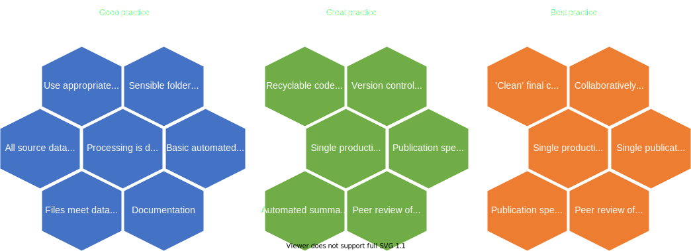
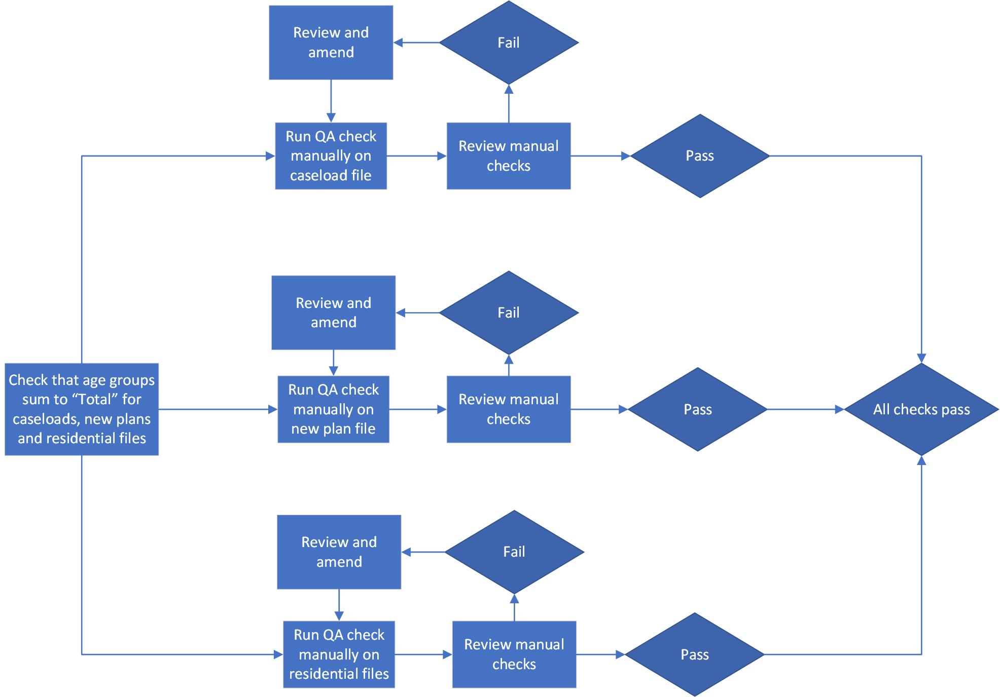
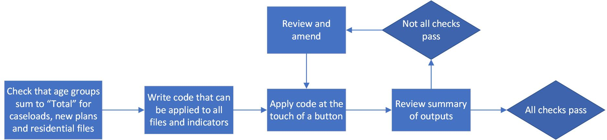

```{r xaringan-themer, include=FALSE}
library(xaringanthemer)
style_duo(
 primary_color = "#1F4257",
 secondary_color = "#F97B64",
 header_font_google = google_font("Poppins", "400"),
 text_font_google   = google_font("Poppins", "250", "250i"),
 code_font_google   = google_font("IBM Plex Mono")
 )
```

```{r setup, include=FALSE}
library(knitr)
library(showtext)
library(xaringan)
library(rmarkdown)
knitr::opts_chunk$set(echo = FALSE)
knitr::opts_chunk$set(error = FALSE)


```


# What we'll cover

???

Remember to record it!!

Introduce selves

Follows on from introduction to RAP that we did around 6 months ago, that's available on our guidance website

--

- What do we mean by 'automated QA'

--

- Why we should use automation in our QA

--

- How to get started

--

- Examples of this in action 

--

- What support is available

--

- Time for questions

---
layout: true

# What is automated QA?

---

--

Writing out our quality assurance processes into code so the computer does the legwork

???

We do QA already

This is all about improving what we already do

Using code and the power of computers to improve our current processes

---

Two main types of QA that we have:

<br>

--

Pass/Fail tests (is a specific variable present)

--

- Computers excel at this, and we should fully automate these checks in code

???

Data screener is a great example of this

Incredibly efficient - around 70 checks that are ran in an instant (depending on file size)

Thoroughly documented - everything is stored in code

Reliable - runs the same checks time after time

Accurate - no human error like we had in the early days when Tom or I were manually checking files and missing things

Automation is really powerful here, but this is only half of the story

---

Two overarching types of QA that we have:

<br>

Sense checking (are the year on year patterns in the data feasible)

--

- Will always require statistician expertise and judgment

--

- We should use code to speed up getting the information we need

--

- We should use code to create visualisations to aid us to do more with this

---

It's a key part of Reproducible Analytical Pipelines (RAP):




???

---

It's a key part of Reproducible Analytical Pipelines (RAP):


???

Red - RAP levels that this directly hits

Purple - RAP levels that are indirectly worked towards by doing this

Highlights how critical this is to RAP


---
layout: false

# Why automate our QA

--

- Reliability

???

Manual steps in production and quality assurance introduce human error – everybody makes mistakes

--

- Efficiency

???

Computers can do a lot of the leg work much quicker than we can

Allows us to rerun at the last minute

--

- Reproducibility

???

Automating it documents it

--

- Thoroughness

???

By automating our QA, we expand the possible checks that we can do on the data

--

- Consistency

???

Consistent QA across all our publications

Can make use of template code to save duplication of effort

--

- Because we're expected to

???

It's a part of RAP

OSR are expecting us to be doing this

The code of practice says we should be using the best methods available

It's our job to be as good at this as we can be

---
layout: true

# Why automate your QA?

---


### Out with the old...


.pull-left[

- How do you answer the question **“am I happy that all my checks pass?”**


- If your QA is **not** automated, this will involve running a check, reviewing the result and amending if needed


]

.pull-right[





]

???
Example here with SEN2 release - previously had to manually run the same check for age group across all indicators in three different files

---
layout: true

# Why automate your QA?

---

### In with the new!

.center[]


--

- How do you answer the question **“am I happy that all my checks pass?”** once you've automated QA?

--

- With automated QA, you can write generalisable code and functions, allowing you to check multiple things at once and review the outcomes of checks in one go

???
You can quickly see if any checks fail, make the relevant amendments and run again.


SEN2 example - only need to write the check once, then apply it across everything


putting the resource into doing it right first will pay off in years to come


---
layout: false

# How to get started

--

- Once you have R and Rstudio downloaded, you can begin automating QA.

--

- We have some template code on [GitHub](https://github.com/dfe-analytical-services/automated-data-qa) that can be used to run some [suggested basic checks](https://rsconnect/rsc/stats-production-guidance/rap.html#Basic_automated_QA).


--
- These cover basic checks like minimum/maximum/average values for indicators, counts for suppressed numbers, checks for duplicates

--

- There are also some templates for scatter plots to look at comparing data by time period

--

- You’ll want to include more specific tests to your data too, e.g.

--
+ Do filter subtotals add up to totals?
+ Are percentages and averages calculated correctly?
+ How do indicators change when you apply various filters?

---

# Applying templates


```
check_LA_region_totals <- function(indicator) 

{
function_definition_here %>% filter(indicator)
}

```
--

- Our templates are written as functions that you can apply to your tidy data

--

- The arguments the function takes are defined inside the function brackets **function()**

--

- To run the code, you just need to tell the R what you want variable you want it to look at, e.g.:

```
check_LA_region_totals(number_on_roll)

```

---

# Examples of basic automated checks

---

### Checking for extreme values

???
Manually, how do you check for extreme values? How do you know you've not missed any?

--
```
  data %>% 
    #Set geographic level here if you want to change to region/LA
    filter(geographic_level == geog_level) %>% 
    group_by(time_period) %>% 
    mutate(!!indicator := as.numeric(get(indicator))) %>% 
    select(all_of(filters),indicator) %>% 
    spread(time_period,indicator) %>% 
    mutate(thresh_indicator_big = get(time_compare) * (1+thresh),
           thresh_indicator_small = get(time_compare) * (1-thresh),
           flag_big = get(current_time) >= thresh_indicator_big,
           flag_small = get(current_time) <= thresh_indicator_small)

```
--

[Example in practice from SEN2](examples/QA_2020_output.html#Caseload20)

---

### Check that your geography subtotals add to the totals where appropriate

???
Manually, how do you check for relevant indicators that LAs add to regions, regions add to national etc?

--
```
data_region <- data %>% 
    filter(geographic_level == "Regional") %>% 
    select(time_period,region_name,region_code,
           all_of(publication_filters),indicator) %>% 
    mutate(!!indicator := as.numeric(get(indicator))) %>% 
    arrange(time_period,region_code,get(publication_filters))
  
  data_la_aggregate <- data %>% 
    filter(geographic_level == "Local authority") %>% 
    select(time_period,region_name,region_code,
           all_of(publication_filters),indicator) %>% 
    group_by(across(-c(indicator))) %>% 
    summarise(!!indicator := sum(as.numeric(get(indicator),
              na.rm = TRUE))) %>% 
    arrange(time_period,region_code,get(publication_filters))
  
 setdiff(data_region,data_la_aggregate)
```
--

[Example in practice from SEN2](examples/QA_csvs_2020_output.html#LA_vs_region_tests)

---

### Sense-check year-on-year trends

???
Manually, how do you look at your tidydata file and pick out the stories? Really hard to do when you have loads of filters and indicators

--
```
data_prep_example <- data %>% 
    filter(geographic_level == "Local authority") %>% 
    select(time_period,region_name,la_name,
           all_of(publication_filters),indicator) %>% 
    mutate(!!indicator := as.numeric(get(indicator))) %>% 
    spread(time_period,indicator) %>% 
    #Make sure you've defined what each filter should be
    filter(eval(parse(text=filter_definition)))
  
  plot_example <- data_prep_example %>%
    plot_ly(
      type = 'scatter', 
      x = ~ get(time_x), 
      y = ~ get(time_y),
      color = ~region_name,
      text = ~paste("Indicator:", indicator , "<br>LA: ", la_name, '<br>',                                                     time_x, ":", get(time_x),'<br>', time_y, ":", get(time_y)),
      hoverinfo = 'text',
      mode = 'markers') %>% 
    layout(
      xaxis = list(title = time_x),
      yaxis = list(title = time_y))

```
--

[Example in practice from CiN/CLA](examples/QA-report.html#Number_of_pupils_by_LA,_this_year_compared_to_last_year)


---

# Example of end-to-end automated checks

---

## SEN 2

- Automating QA as a part of a larger piece of work to automate the end-to-end pipeline for their release

--

- Quality assurance checks at multiple steps of the pipeline: data entry, calculation of indicators, csv outputs

--

- First team to reach “best practice” in RAP so far

--

- Updates to the “variable_change” file have made it easy to transition across for this year

--

###[Demo of SEN2 QA report](examples/QA_2020_output.html)

---

# Data screener app

[ Thought: do we want to do something demo'ing all the cool stuff we've done here, it's an easy way for them to get started on this and also to see the power of it. Though also reaffirm that the end goal is that they use the template code in their processes. Even the screener part of the app will eventually be put into an R package and teams will use that in code scripts in their pipeline. ]

---

# Support

--

[RAP page of the guidance website](https://rsconnect/rsc/stats-production-guidance/rap.html#Basic_automated_QA)

--

[Template code repository](https://github.com/dfe-analytical-services/automated-data-qa/tree/main/R)

--

[Expansion of data-screener app](https://rsconnect-pp/rsc/dev-dfe-published-data-qa/)

-- 

Our team - [statistics.development@education.gov.uk](mailto:statistics.development@education.gov.uk)

---

# Partnership programme


Statistics Development Team (us) working alongside your team to agree goals and deliver over a set preiod of time. E.g.

--

- Help up-skill your team in using SQL and R

--

- Help to transition certain processes into R

--

- Work your way up the [RAP levels](https://rsconnect/rsc/publication-self-assessment/)

--

- Developing a dashboard to sit alongside EES publications

--

- Getting start with automating your QA

--

Anything related to statistics publications - we're a flexible resource to make use of!


---

# QA-ing your QA code

--

Get your code peer reviewed 

???

Part of RAP levels

--

Version control is key - use Git for tracking all updates and changes to code

???

Part of our best practice for RAP

--

Write 'unit tests' on your QA code using the [testthat](https://testthat.r-lib.org/) package

???

Definitely more advanced, and in terms of RAP, this is the next level above our current best practice

--

- Recent coffee and coding session on testing code - link

--

- The tests will use dummy data and check that the code still works as intended

--

- Automatically run these tests after any changes to the code


---

# Recap

--

Using automation in our QA allows us to do more in far less time!

--

It's a key part of RAP, and is one of our priorities

--

Read the guidance on what checks you should consider starting with

--

- Make use of the template code

--

- Expand on this and develop your own

--

Explore the features in the QA app (data-screener)

--

For more complex QA code there are ways to easily QA that and ensure robustness

--

Contact us if you want advice or need help!

---

# Final links

If you have any questions or are interested in our partnership programme, please get in touch:

[statistics.development@education.gov.uk](mailto:statistics.development@education.gov.uk)

--

Today's slides

https://sarahmwong.github.io/intro-to-automating-QA/

--

Made in R using the [xaringan](https://bookdown.org/yihui/rmarkdown/xaringan.html) package

--

Guidance website:

https://dfe-analytical-services.github.io/stats-production-guidance-copy/rap.html

???

Note that that is the public link, the rsconnect version still exists and they both show the same content

Includes slides and recording of the introduction to RAP session

--

Any questions?
